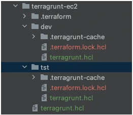
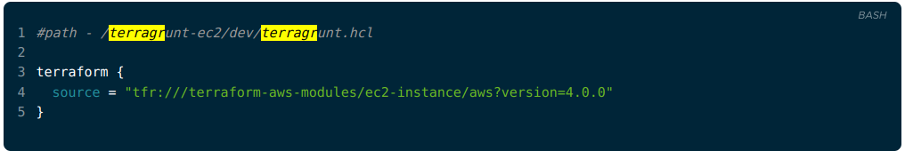
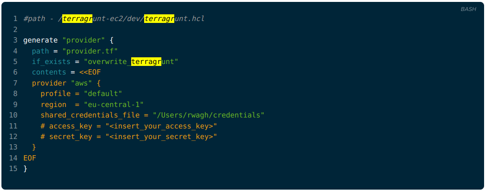
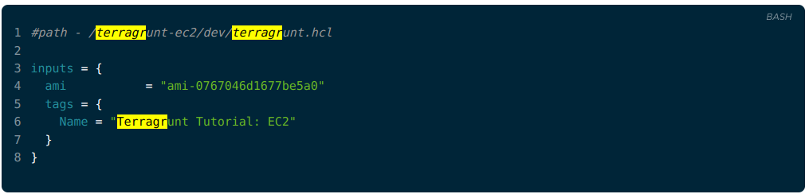
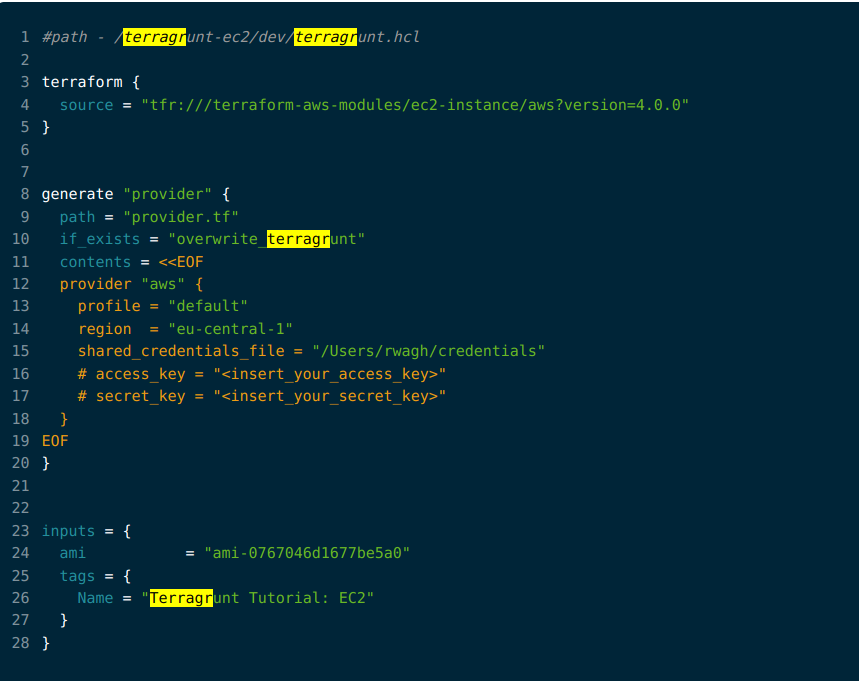
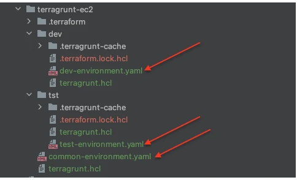

# link: https://jhooq.com/terragrunt-guide/?query=terragr

How to use Terragrunt?

Terragrunt is an additional wrapper that is built on top of the Terraform. Terraform is a great Infrastructure as Code tool for managing your cloud infrastructure. But as the project size grows and you have multiple environments (Development, Testing, Staging, Production, etc..) to manage then you will realize Terraform has a lot of gaps for managing a complex and large project.

Challenges with Terraform - If you are managing multiple environments (Development, Testing, Staging, and Production etc..) infrastructure with Terraform then here are the challenges you might face with Terraform -

Redundancy of code - Multiple copies of the same code for each environment.

Manual update of code - If there are the same variables that are being used for all the environments then you have to remember and manually update each variable.

Terragrunt by gruntwork was built to improve the shortcomings around the Terraform for effectively managing the infrastructure code so that developers can use the same code without any kind of duplication by keeping the terraform code dry. Terragrunt not only helps you with managing your terraform workspaces effectively but it can also help you with multiple terraform modules, managing Terraform remote state, etc.

This guide will you get started with Terragrunt and also you will find example codes for your reference. It will be a very beginner's level guide for those who want to learn Terragrunt and in this guide, we will be taking one basic example of Setting up EC2 instance using Terragrunt for DEV and TEST


## 1. How to install Terragrunt?
Before installing Terragrunt you must complete one pre-requisite by installing Terraform because Terragrunt is just a wrapper around terraform, so to use Terragrunt you must install Terraform.

There are a couple of ways of installing Terragrunt -

### 1.1 Manually download the Terragrunt Binary
1. Download - Goto GitHub release pages of *[gruntwork-io/terragrunt](https://github.com/gruntwork-io/terragrunt/releases)* and download the binary based on the operating system of your choice
2. Untar
```sh
sudo tar xvf terragrunt-0.56.1.tar.gz
```
2. Rename - Rename the downloaded binary file to terragrunt.
```sh
sudo mv terragrunt-0.56.1 terragrunt
```
3. Make it Executable - Change the binary file permission to make it executable.
```sh
sudo chmod u+x terragrunt 
```
4. Move the binary file to /usr/local/bin(Linux and Mac)
```sh
sudo mv terragrunt /usr/local/bin/terragrunt
```
### 1.2 Install Terragrunt using package manager
- If you do not like the manual installation of the Terragrunt then you can go with the package manager based on your operating system choice.

##### **Windows**- For windows you can rely on chocolatey package manager -
```bash
choco install terragrunt 
```
##### macOS- For mac you can install it with the help of Homebrew -
```bash
brew install terragrunt
```
##### Linux- For Linux either you could use Homebrew just like mac or you could go with manual installation. For Arch Linux user you could use the following installation command -
```sh
pacman -S terragrunt
sudo snap install terragrunt
```

## 2. Write your first Terragrunt implementation using the ec2-instance module

In the previous step we have installed the Terragrunt along with Terraform. Now next problem we have is How to use Terragrunt for provisioning the cloud infrastructure?

But before we answer the question there are few points which you should know about terragrunt -

Terragrunt never recommends duplication of code.

Terragrunt heavily relies on modules, so that we can keep our code dry without polluting with the duplicate code

What are the necessary configuration you need to write your first Terragrunt implementation?

- Terraform AWS modules *(Note - If you are working with Google Cloud then refer to Google Module)*

- You will need terragrunt.hcl for writing your Terragrunt configuration.

- Use commands - `terragrunt plan, terragrunt apply, terragrunt output, terragrunt destroy`

### 2.1 Package structure for my Terragrunt project
To keep the things simple I am gonna use the very a basic example in which we are going to setup an EC2 instance on DEV and TEST environments using terragrunt

Project Structure - Here is the screenshot of my project structure -


EC2 Instance Module - To use Terragrun we need to know the modules which we are going to use in our project. But since this is a getting started a project we are doing, I decided to go ahead with EC2 Module.
Here are a few starting lines of your terrgrunt.hcl where you need to mention the reference of EC2 Module -


Notes-

As you can see we are referring to the remote EC2 Module with -
Source URI - "tfr:///terraform-aws-modules/ec2-instance/aws?version=4.0.0"

provider details- The next configuration we need to add inside terragrunt.hcl is the provider configuration. Provider configuration generally consists of three important elements -
profile
region
credentials: In my current setup, I am using shared_credential_file to pass the credentials but you can use access_key and secret_key instead
Here is the example configuration for the provider which we will be using inside the terragrunt.hcl -


- Notes -

    - The provider can be optional and it can be avoided if the provider.tf configuration exists already inside DEV or TEST environment.

    - The above provider configuration will overwrite any existing local provider configuration

    - Inputs- Next we need to define the inputs configuration because for each Terragrunt implementation we need to provide some mandatory inputs. So for our case of EC2 we will need the following mandatory parameters -

        - ami
        - tags



### 2.2 Here is my final terragrunt.hcl
In the previous steps, we have gone through all the necessary configuration parameters which are needed for preparing the terragrunt.hcl. Here is my complete terragrunt.hcl -


3. How to run - terragrunt plan, terragrunt apply, terragrunt output and terragrunt destroy
3.1 terragrunt init
Let's apply the Terragrunt configuration to create EC2 instances. The first command you need to run is trragrunt init. Before running the terragrunt init command you must switch to the directory where the terragrunt.hcl is present.


3.2 terragrunt plan
The next command you can run is terragrunt plan which is also similar to the terraform plan command. The terragrunt plan command is going to validate your Terragrunt configuration and will return you back with the information on how many resources it is going to add, update or destroy.

Since this is the first time we are going to create a EC2 instance so it should show that 1 resource it is going to add.

3.3 terragrunt apply
If all of your Terragrunt configurations is correct and there is no error associated with it then you can simply execute terragrunt apply command which will create an EC2 instance

4.2 Verify using Terragrunt output command
Terragrunt also provides you with one more useful command terragrunt output to verify the details of the resources which you have provisioned using the Terragrunt.

As in our use case, we have created an EC2 instance, so we could also verify the details of running the EC2 instance with the help of command terragrunt output

5. Remove the AWS resources using - terragrunt destroy
Now the last command for Terragrunt is - terragrunt destroy. In all the previous steps we have set up and started EC2 instance. After doing the successful verification of the instance let's try to delete/destroy the EC2 instance with the terragrunt destroy command.

Goto terminal and simply run the following command -

6. Locals and Values files handling
Now we have seen how you can get yourself started with Terragrunt but there is one more very essential feature of Terragrunt knows a values files. Terragrunt allows you to externalize the values files so that you can define common input variables as well as environment-specific variables.

For Example - We have taken two environments for this tutorial .i.e. - DEV, and TEST. To make our Terragrunt setup more generic we can create one common common-environment.yaml which we can place at the root of the project. So that all the common input variables can be defined in it.

Along with that we can also create environment specific values file .i.e. - dev-environment.yaml, test-environment. yaml for DEV and TEST

Here is the screenshot of my project structure -


After creating the values files, we have to define some common variables for DEV, TEST as well as define some environment-specific variables for each environment.

Define some variables inside common-environment.yaml- As you know this is just a tutorial so we are going to define a common variable for EC2 instance type


How to include common-environment.yaml?- In the previous step we have defined a common variable instance_type but to use that variable inside terragrunt.hcl you have to use yamldecode function inside the input block.
Example -

 #path - /terragrunt-ec2/common-environment.yaml

locals {
  env_vars = yamldecode(
  file("${find_in_parent_folders("common-environment.yaml")}"),
  )
}
BASH
After including the common-environment.yaml we have to use the variable instance_type inside the inputs section of terragrunt-hcl. You can use the same locals rules which we use while referring to locals inside terraform.

Example -

#path - /terragrunt-ec2/common-environment.yaml
 
inputs = {
  ami           = "ami-00c90dbdc12232b58"
  instance_type = local.env_vars.locals.instance_type
  tags = {
    Name = "Terragrunt Tutorial: EC2"
  }
}
BASH

7. Handling Inputs and Variable Precedence
Let's take the same example to deep dive into the input parameters which we have defined inside the terragrunt. hcl. The input block is there for you to set values for the module's input parameter.

There are a few rules on how you should create input block -

the block should start with inputs
Example -

inputs = {
  ami           = "ami-00c90dbdc12232b58"
  instance_type = "t2.micro"
}
BASH
You need to create an input block inside terragrunt.hcl
As soon as you execute terragrunt apply command all the values you have defined inside the input block will be pass in as environment variables for your module.
TF_VAR_XXX - If you have already defined variables.tf inside your terraform project or modules then inputs the block will not override the values from the inputs block.
7.1 Overriding precedence of variables in terragrunt
The variables overriding precedence are the same as Terraform. But if the same variables have been defined multiple numbers of times then it will use the last assigned value.

But if you are interested in knowing the order of overriding precedence then you should follow these orders -

Terragrunt will first try to load the variables from Environment Variables
It will look for the same variables in terraform.tfvars
It will also look inside terraform.tfvars.json
Anything defined inside .auto.tfvars/.auto.tfvars.json will be processed in order of their filenames
Anything passed as an option -var/-var-file from the command line will take the precedence

8. Summary
If you have followed all the steps of this blog then I can say for sure you have a good understanding of the basics of Terragrunt and you can make your implementation of Terragrunt. Let's recap what we have learned so far -

We have installed Terragrunt along with the terraform and also verified the installation of terragrunt
Setup a small EC2 instance using Terragrunt's EC2 instance module
Along with the EC2 instance we have also seen how to layout your project structure for different environment (Development, Test, Stage, Prod)
We also set up the environment-specific terragrunt.hcl for DEV as well as TEST environment
Considering this post as a beginners tutorial for Terragrunt you will have a better understanding of how to -
Include module
Define locals inside your Terragrunt project
write provider block
Write input block for module's input
In the blog post we have also seen how you can externalize the common-environment.yaml so that you can define common local variables as well as define environment specific variables.
I have some more thoughts on Terragrunt so in the upcoming months, I will write some more posts on Terragrunt and will be updating the list here. Here are my upcoming post topics on Terragrunt -

Setting up S3 Bucket and remote state file using Terragrunt
Creating your own module on Github for Terragrunt
Terragrunt goto guide with more example on - dependencies, merge